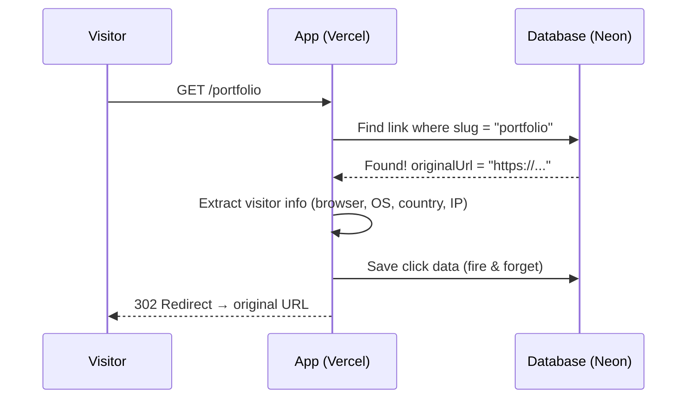
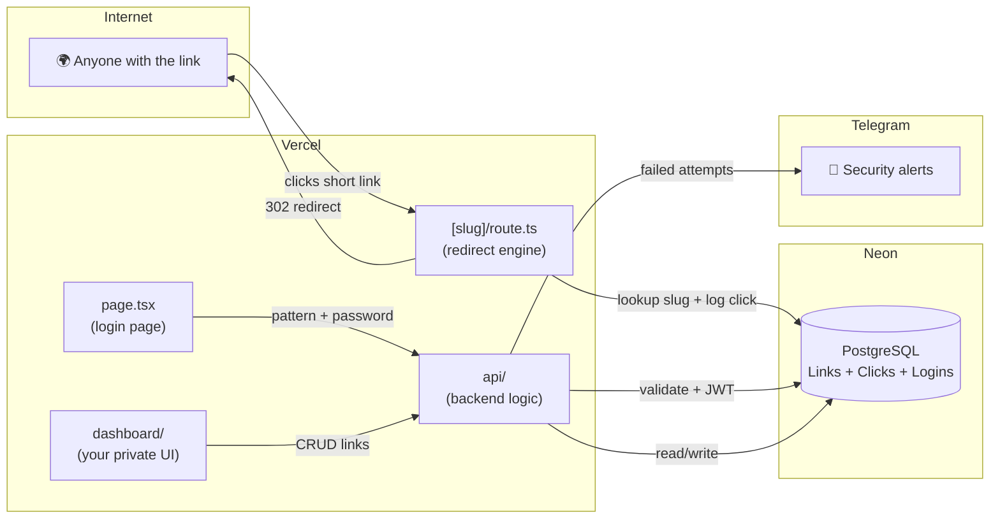

# LinkPlanet — Project Architecture

> A personal URL shortener with analytics, built for a solo creator who needs branded short links with full visibility into who's clicking them.

---

## The Core Idea

You have long URLs you want to share — portfolio pages, project demos, social links. Instead of sending ugly long URLs, you create short ones like:

```
vignesh-designspace.vercel.app/portfolio
```

When someone visits that link, the app instantly redirects them to the real destination and **silently logs everything** — what country they're in, what browser they use, what device, when they clicked. You get a private dashboard to see all of this.

It's a one-person tool. No user registration, no teams. Just you, your links, and your data.

---

## How a Click Actually Works (The Redirect Flow)

This is the heart of the app. Here's what happens in ~200ms when someone visits a short link:



**Key detail:** The click tracking is "fire and forget" — the app starts saving the click data but **doesn't wait for it to finish** before redirecting the visitor. This keeps redirects instant. The actual code:

```
[slug]/route.ts → finds slug → logs click (async) → 302 redirect
```

---

## How You Log In (Two-Step Auth)

The dashboard is locked behind a two-step auth flow. No username/email — it's pattern + password.

```
┌─────────────────────┐     ┌─────────────────────┐     ┌─────────────┐
│  Step 1: Pattern     │────▶│  Step 2: Password    │────▶│  Dashboard  │
│  (Draw on 3×3 grid)  │     │  (Type password)     │     │  (JWT token)│
└─────────────────────┘     └─────────────────────┘     └─────────────┘
        ▲ fail                       ▲ fail
        │                            │
   IP tracked &               IP tracked &
   Telegram alert             Telegram alert
   after 3 fails              after 2 fails
```

### How the pattern lock works:
1. You draw a pattern on a 3×3 grid (like Android lock screen)
2. The pattern is converted to a sequence of numbers (e.g., `1-5-9-6-3`)
3. That sequence is compared against a **bcrypt hash** stored in the environment variable `PATTERN_HASH`
4. If correct → shows the password field
5. If wrong → tracks the attempt by IP, sends you a Telegram alert after 3 fails

### How the password works:
1. You type the password
2. It's compared against `PASSWORD_HASH` (also bcrypt)
3. If correct → creates a **JWT token** (valid for 7 days) stored as an httpOnly cookie
4. If wrong → tracks by IP, sends Telegram alert after 2 fails

### Why two steps?
Even if someone guesses or sees your password, they still need the pattern. And if someone tries to brute-force either step, you get a Telegram notification with their IP.

---

## The Database (3 Tables)

The app uses **PostgreSQL** hosted on **Neon** (serverless Postgres). The schema is managed by **Prisma** (an ORM that lets you talk to the database with JavaScript instead of raw SQL).

```
┌──────────────────────────┐
│         Link             │
├──────────────────────────┤
│ id          (unique ID)  │
│ slug        (the short   │──────┐
│              part, e.g.  │      │
│              "portfolio") │      │
│ originalUrl (where it    │      │
│              redirects)  │      │
│ active      (on/off)     │      │
│ createdAt                │      │
│ updatedAt                │      │
└──────────────────────────┘      │
                                  │ one-to-many
┌──────────────────────────┐      │
│         Click            │◀─────┘
├──────────────────────────┤
│ id                       │
│ linkId     → Link.id     │
│ browser    (Chrome, etc) │
│ os         (Windows, etc)│
│ device     (Mobile, etc) │
│ country    (from Vercel) │
│ referrer   (where from)  │
│ ip                       │
│ createdAt                │
└──────────────────────────┘

┌──────────────────────────┐
│      LoginAttempt        │
├──────────────────────────┤
│ id                       │
│ ip         (unique)      │
│ patternFails  (counter)  │
│ passwordFails (counter)  │
│ updatedAt                │
└──────────────────────────┘
```

**Key relationships:**
- One **Link** has many **Clicks** (every visit creates a Click record)
- Deleting a Link cascades and deletes all its Clicks too
- **LoginAttempt** is tracked per IP address — completely separate from links

---

## File Structure (What Lives Where)

```
app-src/
├── prisma/
│   └── schema.prisma          ← Database models (the 3 tables above)
│
├── src/
│   ├── lib/
│   │   ├── prisma.ts          ← Database connection (singleton)
│   │   └── telegram.ts        ← Sends Telegram alerts on suspicious logins
│   │
│   ├── components/
│   │   ├── LinkAnalyticsCharts.tsx   ← Charts on the link detail page
│   │   ├── ConfirmDeleteModal.tsx    ← "Are you sure?" modal for deleting
│   │   └── ConfirmDeactivateModal.tsx ← Modal for toggling link on/off
│   │
│   └── app/
│       ├── layout.tsx         ← Root layout (fonts, metadata)
│       ├── globals.css        ← Global styles
│       ├── page.tsx           ← LOGIN PAGE (pattern + password)
│       │
│       ├── [slug]/
│       │   └── route.ts       ← THE REDIRECT ENGINE (GET /anything)
│       │
│       ├── dashboard/
│       │   ├── page.tsx       ← DASHBOARD (list all links + stats)
│       │   ├── create/
│       │   │   └── page.tsx   ← CREATE LINK form
│       │   └── links/
│       │       └── [id]/
│       │           └── page.tsx ← LINK DETAIL (analytics for one link)
│       │
│       └── api/
│           ├── auth/
│           │   ├── pattern/
│           │   │   └── route.ts  ← POST: validate pattern
│           │   └── password/
│           │       └── route.ts  ← POST: validate password → set JWT
│           │
│           └── links/
│               ├── route.ts      ← POST: create link, GET: list all
│               └── [id]/
│                   └── route.ts  ← GET: link detail + analytics
│                                    PATCH: toggle active
│                                    DELETE: remove link
│
├── .env                       ← Secrets (DB URL, auth hashes, Telegram)
└── package.json
```

---

## The API (What Talks to What)

| Endpoint | Method | What it does |
|---|---|---|
| `/api/auth/pattern` | POST | Validates the drawn pattern against bcrypt hash |
| `/api/auth/password` | POST | Validates password, sets JWT cookie for 7 days |
| `/api/links` | GET | Returns all links with click counts (for dashboard) |
| `/api/links` | POST | Creates a new short link (auto-generates slug if not provided) |
| `/api/links/[id]` | GET | Returns one link with full analytics (time-series, countries, devices) |
| `/api/links/[id]` | PATCH | Toggles a link active/inactive |
| `/api/links/[id]` | DELETE | Permanently deletes a link and all its click data |
| `/[slug]` | GET | **The redirect** — looks up slug, logs click, 302 redirects |

---

## Analytics — What Gets Tracked

When someone clicks a short link, the app extracts this info from their request:

| Data | How it's captured |
|---|---|
| **Browser** | Parsed from the `User-Agent` header (Chrome, Firefox, Safari, etc.) |
| **OS** | Parsed from the `User-Agent` header (Windows, macOS, iOS, Android, etc.) |
| **Device** | Parsed from the `User-Agent` header (Mobile, Tablet, Desktop) |
| **Country** | From Vercel's `x-vercel-ip-country` header (auto-detected, free) |
| **Referrer** | The `referer` header — where the visitor came from |
| **IP** | From `x-forwarded-for` header |
| **Timestamp** | Auto-set by the database |

### How the dashboard shows this data

The link detail API pre-processes the raw clicks into chart-ready data:

- **Month view** → Last 30 days, one data point per day
- **Year view** → Last 12 months, one data point per week
- **All-time view** → Grouped by month
- **Country breakdown** → Top 6 countries + "Other"
- **Device breakdown** → Mobile / Tablet / Desktop split

---

## Security Features

| Feature | How it works |
|---|---|
| **Two-step auth** | Pattern lock → Password (both bcrypt hashed) |
| **JWT sessions** | 7-day httpOnly secure cookie (can't be read by JavaScript) |
| **Brute-force tracking** | Failed attempts tracked per IP in database |
| **Telegram alerts** | Bot messages you when someone fails pattern 3+ times or password 2+ times |
| **No public registration** | There's no signup. Only you can access the dashboard |

---

## Tech Stack Summary

| Layer | Tool | Why |
|---|---|---|
| **Framework** | Next.js 15 (App Router) | Full-stack React — pages + API in one project |
| **Database** | PostgreSQL on Neon | Serverless Postgres, scales to zero when idle |
| **ORM** | Prisma | Write database queries in TypeScript, auto-generates types |
| **Hosting** | Vercel | Zero-config deployment, automatic HTTPS, edge network |
| **Auth** | bcryptjs + jose (JWT) | Password hashing + token creation — no heavy auth library |
| **Alerts** | Telegram Bot API | Free, instant push notifications to your phone |
| **Styling** | Tailwind CSS | Utility-first CSS directly in the components |

---

## How It All Connects



---

## Current Domain Setup

- **Live URL:** `vignesh-designspace.vercel.app`
- This is the Vercel project name, which auto-generates the `.vercel.app` subdomain
- All short links are served as: `vignesh-designspace.vercel.app/{slug}`
- The app is single-tenant (one user only — you)
